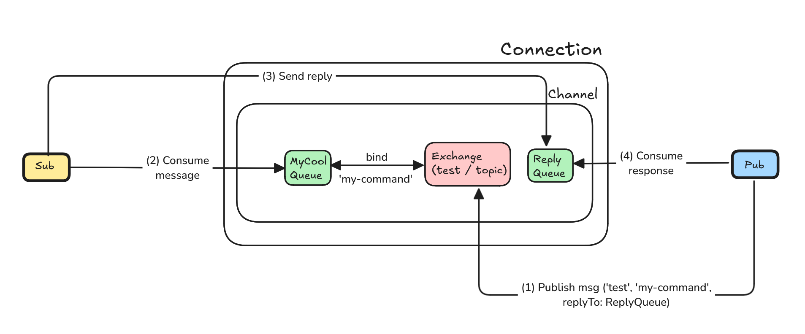

## Subscriber, Publisher
1. Establish connection to the RabbitMQ
2. Create a channel with RabbitMQ
3. Create or connect to exchange - await `channel.assertExchange`('name_exchange', 'type_exchange', options)

## Subscriber
4. Create a queue  - await `channel.assertQueue`('queue_id', options)
5. Bind this queue to exchange (await `channel.bindQueue`('queue_id', 'exchange_name', 'event_name'))
6. Start to consume messages from queue - `channel.consume`('queue_id', cb)
7. If we get message and this message requires of acknowledgement - send message to this replyQueue:
    - `channel.sendToQueue`('reply_to_queue', some_data, {correlationId: message.fields.correlationId})

## Publisher
4. Create a replyQueue - await `channel.assertQueue`('', { exclusive: true })
5. Start to consume messages from replyQueue - `channel.consume`('queue_id', cb)
6. Send message to exchange:
    - `channel.publish`('name_exchange', 'event_name', message, {replyTo: 'reply_queue_id', correlationId: string }) 
	

## How does it work?
- [Publisher]: Send a message to the exchange
- [Exchange]: Gets this message and redirects to the subscriber
- [Subscriber]: Check if there is replyTo option and it that is case - reply to this queue
- [Publisher]: Gets message from the replyQueue

